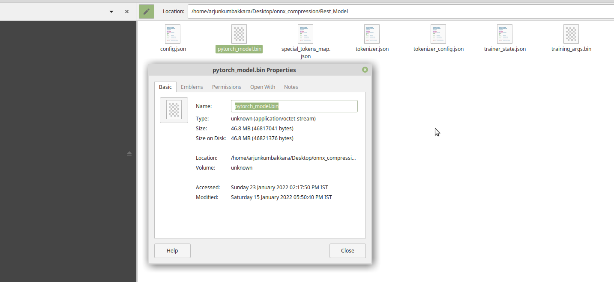

# onnx_model_size_compression
Just a simple pythonic way of reducing the onnx converted model. This implementation is based on a tip by the Team ONNX .

[](https://hits.seeyoufarm.com)


## Authors
## Nabarun Barua 
- [Git](https://github.com/nabarunbaruaAIML)
- [LinkedIn](https://www.linkedin.com/in/nabarun-barua-aiml-engineer/)
## Arjun Kumbakkara 
- [Git](https://github.com/arjunKumbakkara)
- [LinkedIn](https://www.linkedin.com/in/arjunkumbakkara/)

## Synopsis:

## Case: AlBERT model trained for text classification clocked at 46.8mb of size of the .bin weights file. When converted to the ONNX runtime , it became 345mb .We tried all optimizations on python before the conversion. However, the way out was to convert the .onnx converted weights to a compressed version

Original weights size:



However the  size upon conversion spiked to 340 mb.

Onnx weights size:


## Excerpt from ONNX Team on the Correctness of the solution: 
" ALBERT model has shared weights among layers as part of the optimization from BERT . 
The export  torch.onnx.export outputs the weights to different tensors as so model size becomes larger.
Using the below python Script we can remove duplication of weights, and reduce model size
ie,  Compare each pair of initializers, when they are the same, just remove one initializer, and update all reference of it to the other initializer."
#### """ONNX Team @tianleiwu"""


Post implementation : 

Compressed Onnx weights size:


Dependencies for your Reference: 


```bash
pip install --upgrade transformers sentencepiece
pip install --upgrade onnxruntime
pip install --upgrade onnxruntime-tools
```

